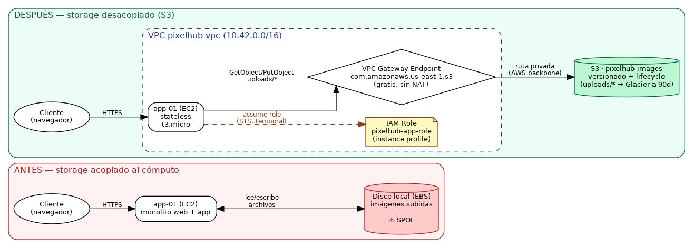

# Arquitectura — PixelHub: Galería de imágenes → S3

## El problema

`app-01` es un único EC2 que corre la app web de PixelHub y guarda las imágenes que suben los clientes en su disco (EBS) local. La app las lee directo de ahí para servirlas. Es simple, pero acopla storage y cómputo: no escala independiente, no es durable (un disco es un disco) y no tiene forma sana de compartir esas imágenes con otra instancia si el equipo decide escalar horizontalmente más adelante.

## Alcance de la migración

Un componente, no la app entera: **sacar el storage de imágenes del disco local y ponerlo en S3**, dejando `app-01` como está (mismo cómputo, mismo código de negocio) salvo por dónde lee/escribe archivos.

## Diagrama

Ver `architecture.drawio` (editable en [app.diagrams.net](https://app.diagrams.net) → File → Open) y su render en `architecture.png`:

## Componentes

| Componente local (LocalStack) | Equivalente cloud (AWS real) | Identidad / credencial |
|---|---|---|
| Disco local (EBS) de `app-01` | **S3** bucket `pixelhub-images`, versionado, lifecycle a Glacier a los 90 días | Bucket policy: sólo el rol de la app, sólo desde el VPC endpoint, sólo TLS |
| Credenciales hardcodeadas en el código (anti-patrón actual) | **IAM Role** `pixelhub-app-role` asumido vía **instance profile** de EC2 | Trust policy: sólo `ec2.amazonaws.com` puede asumirlo. Identity policy: `GetObject`/`PutObject` sólo bajo `uploads/*`, `DeleteObject` explícitamente denegado |
| Salida a internet vía gateway/NAT (implícita, no diseñada) | **VPC Gateway Endpoint** hacia S3 (`com.amazonaws.us-east-1.s3`) | Endpoint asociado a la route table de la subred de `app-01`; sin costo por hora ni por GB |
| `app-01` (EC2, monolito con estado) | `app-01` (EC2, **stateless**) — mismo tamaño (`t3.micro`), ahora sin disco de datos que respaldar | Instance profile `pixelhub-app-instance-profile` (sin access keys en el servidor) |

## Puntos únicos de falla identificados

| SPOF | Mitigación en cloud |
|---|---|
| Disco local de `app-01`: si se llena, se corrompe o el host se cae, se pierden las imágenes | S3 replica automáticamente entre múltiples AZ (11 nueves de durabilidad); versionado protege contra sobrescrituras/borrados accidentales |
| Credenciales de larga duración si se usara un IAM user en vez de un rol | Instance profile + STS: credenciales temporales, rotadas automáticamente cada pocas horas, nunca persistidas en disco |
| Acceso a S3 dependiente de una ruta a internet (NAT Gateway: costo + punto de falla + latencia) | VPC Gateway Endpoint: ruta privada por el backbone de AWS, sin NAT, sin exposición a internet, gratis |
| Storage y cómputo acoplados en la misma instancia | Al desacoplar, `app-01` puede escalar (Auto Scaling) sin arrastrar el storage; varias instancias pueden compartir el mismo bucket |

## Decisiones de identidad

- **Cómo se autentican los servicios entre sí:** `app-01` no tiene ninguna access key. Al arrancar, EC2 le entrega credenciales temporales del rol `pixelhub-app-role` vía el instance profile (metadata service + STS `AssumeRole`), y el SDK las renueva solo antes de que expiren.
- **Quién/qué puede acceder a qué recurso:** el rol sólo puede `GetObject`/`PutObject` sobre `pixelhub-images/uploads/*` (ni todo el bucket, ni otras acciones). Además, la bucket policy exige que la request venga del VPC endpoint (`aws:sourceVpce`) y por TLS (`aws:SecureTransport`) — doble candado: identidad (quién) + red (desde dónde).
- **Cómo se rotan las credenciales:** automáticamente. Al ser credenciales de rol vía STS, no hay rotación manual ni claves para revocar si un desarrollador se va — se le saca el acceso a la consola/CLI y listo, el rol de la instancia no depende de ninguna persona.
- **Qué NO puede hacer la app:** borrar objetos (`s3:DeleteObject` denegado explícitamente) — el ciclo de vida de los datos viejos lo maneja el lifecycle rule (archivado a Glacier), no el código de la aplicación. Esto evita que un bug en la app borre imágenes de producción.
