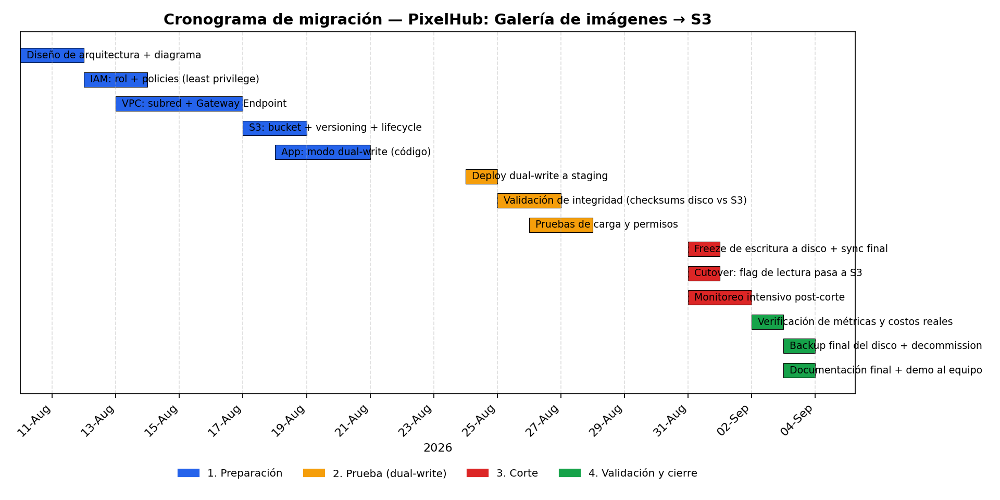

# Cronograma — PixelHub: Galería de imágenes → S3

4 fases, ~3.5 semanas hábiles. Datos editables en `gantt.csv` (columna `depende_de` documenta el orden de dependencias). Diagrama en `gantt.png`.

## Fases

**1. Preparación (10-21 ago.)** — se levanta toda la infraestructura de destino sin tocar producción todavía: diagrama de arquitectura, rol IAM y políticas de privilegio mínimo, VPC + Gateway Endpoint, bucket S3 con versioning y lifecycle, y el cambio de código en `app-01` para escribir en modo dual-write (disco + S3 al mismo tiempo).

**2. Prueba / dual-write (24-28 ago.)** — se despliega el dual-write a staging y se corre en paralelo unos días: se comparan checksums entre lo que quedó en el disco y lo que llegó a S3, y se valida que los permisos del rol alcancen (ni de más ni de menos) bajo carga real.

**3. Corte (31 ago. - 2 sep.)** — es el día puntual: se congela la escritura al disco, se hace el último sync, y se cambia el flag de lectura para que `app-01` sirva las imágenes desde S3. Las 24-48h siguientes son de monitoreo intensivo (errores 404/403, latencia, costos de requests) por si hay que revertir el flag rápido.

**4. Validación y cierre (2-4 sep.)** — se comparan costos reales contra la estimación de `costs.md`, se hace un backup final del disco antes de dar de baja el volumen EBS, y se documenta el resultado.

## Por qué esta secuencia (no un "big bang")

Ver ADR 006 en `decisions.md`: el dual-write agrega unos días de trabajo extra pero da una ventana segura para validar S3 con tráfico real antes de depender de él — y una forma barata de volver atrás (apagar el flag) si algo no cierra en el corte.
